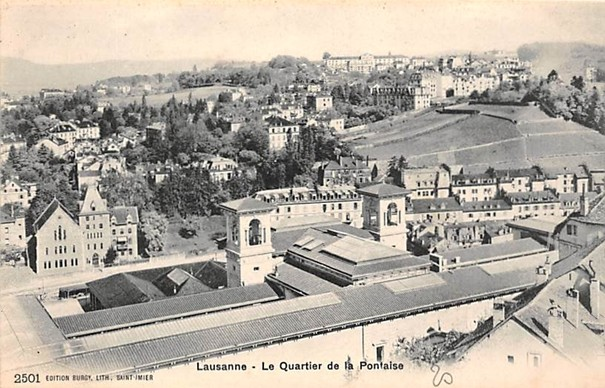

<h1>La Pontaise et Prélaz :  Analyser Lausanne sous le prisme du quartier</h1>

Ce site présente notre projet de recherche mené dans le cadre du cours <em>Histoire Urbaine Digitale - Lausanne Time Machine (2025-2026)</em> à l’EPFL.

Notre travail propose d'étudier la construction, l'identité et les limites des quartiers de Lausanne à travers deux cas d'étude contrastés : la Pontaise et Prélaz, sur une période charnière allant de 1870 à 1945.

<h2>Question de recherche</h2>

À travers cette analyse comparative, nous cherchons à répondre aux questions suivantes :

<ul>
<li><strong>Évolution comparée :</strong> Comment les quartiers de la Pontaise et de Prélaz se distinguent-ils entre eux par leur évolution géographique et sociale entre 1870 et 1945 ?</li>
<li><strong>La notion de « quartier » :</strong> La dénomination de quartier est-elle pertinente pour ces espaces périphériques en pleine mutation ?</li>
<li><strong>Marqueurs :</strong> Quels marqueurs physiques (infrastructures, institutions) ou sociaux (commerces, associations) permettent de les distinguer ? Existe-t-il des sous-quartiers (comme les cités ouvrières), voire des méta-quartiers ?</li>
</ul>

<h2>Deux trajectoires urbaines (1870-1945)</h2>

Notre étude s'appuie sur deux dynamiques distinctes qui illustrent la diversité du développement lausannois :

<h3>La Pontaise (Les hauts de Lausanne)</h3>

Un développement impulsé par des choix institutionnels et militaires (la Caserne, le Stand de tir) ainsi que par l'installation d'infrastructures parfois rejetées par le centre-ville (les abattoirs, la prison du Bois-Mermet).

C'est un espace où les contraintes administratives font naître, par réaction, une véritable conscience et solidarité de quartier.

<h3>Prélaz (Les bas de Lausanne)</h3>

Une urbanisation dictée par la topographie de la basse vallée du Flon et façonnée par l'industrialisation (dépôt des tramways, gare de marchandises CFF, usine de biscuits).

Ce secteur ouvrier voit se développer des réponses concrètes à la précarité et à la salubrité, notamment à travers le prisme de l'hygiénisme (le collège moderne de Prélaz, les jardins familiaux de Prélaz-Cottages).

<h2>Méthodologie et Sources</h2>

Pour mener à bien cette analyse historique et géographique, nous croisons différentes sources issues des archives lausannoises :

<ul>
<li>Des données topographiques et toponymiques extraites des cartes historiques pour suivre l'évolution du bâti et des infrastructures.</li>
<li>Des données administratives extraites des annuaires pour suivre l'évolution socio-professionnelle au sein des quartiers.</li>
<li>Des articles de presse d'époque (notamment <em>la Gazette de Lausanne</em>) pour documenter la vie quotidienne, les tensions locales et les dynamiques sociales.</li>
<li>Des documents iconographiques historiques (photographies, plans de situation) pour illustrer les rues de l'époque.</li>
</ul>

<h2>Structure du site</h2>

Notre site se structure en quatre "quartiers" :

<ol>
<li>Une narration rappelant l'histoire de la Pontaise et Prélaz, basée sur la presse ;</li>
<li>Une visualisation de l'iconographie de l'époque pour la Pontaise et Prélaz ;</li>
<li>Une visualisation dynamique des cartes et l'évolution des toponymies ;</li>
<li>Une navigation interactive basée sur l'évolution du bâti et des métiers.</li>
</ol>

Vue de la caserne de la Pontaise

