

<h1>La Pontaise et Prélaz :  Les hauts et les bas de Lausanne</h1>

<h2>Résumé</h2>

Situés respectivement sur le plateau nord et dans le fond de la vallée à l’ouest de Lausanne, les quartiers de la Pontaise et de Prélaz se sont chacun construits au gré des décisions politiques et industrielles, et témoignent de dynamiques de quartiers spécifiques et prononcées.

<h3>La Pontaise</h3>

La Pontaise s’est développée et construite à partir de choix institutionnels : l’emplacement de la caserne pour la première Division Fédérale en novembre 1878<a href="#fn1" id="ref1" class="footnote-link">[1]</a>, au détriment de l’emplacement de la Cité, marque un tournant dans le rôle que jouera le quartier dans les décennies suivantes. La présence dans le même quartier de l’Orphelinat (1873)<a href="#fn2" id="ref2" class="footnote-link">[2]</a> du stand de tir (agrandi en 1881)<a href="#fn3" id="ref3" class="footnote-link">[3]</a>, des abattoirs (1887)<a href="#fn4" id="ref4" class="footnote-link">[4]</a>, puis de la prison du Bois-Mermet (1904-5)<a href="#fn5" id="ref5" class="footnote-link">[5]</a> démontre que la Pontaise s’est démarquée par des institutions rejetées par la ville.

Le climat du quartier, parfois conflictuel entre recrues militaires et habitants, tireurs et promeneurs, a été régulièrement polémique. Par l’entremise des <em>Amis de la Pontaise</em>, le quartier s’est régulièrement insurgé contre l’emplacement du stand de tir (bien que sécurisé en 1921<a href="#fn6" id="ref6" class="footnote-link">[6]</a>, elle en demandera le déplacement en 1934 encore)<a href="#fn7" id="ref7" class="footnote-link">[7]</a>, contre les décisions des colonels de la caserne (la querelle autour de la sortie de quartier en 1901 en est un exemple)<a href="#fn8" id="ref8" class="footnote-link">[8]</a>.

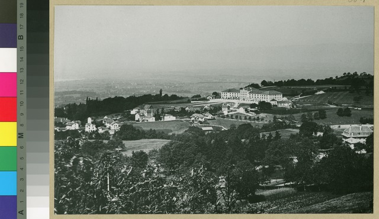
Vue de la caserne prise depuis le Signal de Sauvabelin 1890

<h3>Prélaz</h3>

A Prélaz, en revanche, l’urbanisation a été dictée par la topographie et répond à une logique d’industrialisation de fond de vallée. C’est son emplacement stratégique, dans la basse vallée du Flon, qui en fait le lieu idéal pour installer la gare de marchandises CFF (si le lieu est décidé dès juillet 1878<a href="#fn9" id="ref9" class="footnote-link">[9]</a>, il n’est effectif qu' en mai 1927)<a href="#fn10" id="ref10" class="footnote-link">[10]</a>.

Ce sont les tramways lausannois qui y installent leur dépôt en 1902<a href="#fn11" id="ref11" class="footnote-link">[11]</a> : le quartier se dote aussi d’une industrie de biscuits (Manufacture de Biscuits (1904-1910))<a href="#fn12" id="ref12" class="footnote-link">[12]</a> qui forment le caractère ouvrier et industriel du quartier. La chronique des faits divers est principalement dominée par des accidents de tramways (vélos ou piétons).

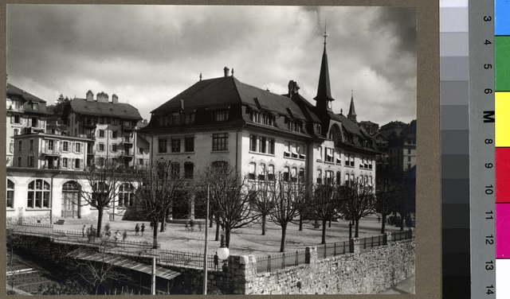
Collège de Prélaz

<h2>L’évolution des quartiers</h2>

Malgré leurs vocations différentes, les deux secteurs périphériques connaissent un développement similaire : morcellement des origines, l’émergence due à l’irruption de grandes infrastructures, période de tensions sociales et infrastructurelles, avant d’atteindre une phase de stabilisation.

<h3>Les origines</h3>

En 1870, la Pontaise est constituée de modestes maisons unifamiliales tandis que Prélaz se distingue par ses prés irrigués et ses domaines et campagnes patriciennes (<em>La campagne de Prélaz, Petit-Prélaz, Villa Prélaz</em>) qui vendent, de temps à autre, des fruits et du bétail<a href="#fn13" id="ref13" class="footnote-link">[13]</a>. En 1873, l’orphelinat se déplace pour aller dans le quartier de la Pontaise<a href="#fn2" id="ref2" class="footnote-link">[2]</a>.

<h3>Les premiers bouleversements</h3>

Ensuite, le quartier se transforme par l’établissement de la Caserne pour la Pontaise, et de la gare de fret CFF pour Prélaz.

<ul>
<li><strong>À la Pontaise :</strong> Le choix de l'emplacement de la caserne est l’issue d’un long débat à Lausanne, qui préfère l’emplacement de la Cité à celui des hauts de Lausanne. Finalement, pour des raisons budgétaires (fr. 400’000) et de salubrité, ce sont les Plaines du Loup qui verront surgir de terre les bâtiments militaires<a href="#fn1" id="ref1" class="footnote-link">[1]</a>. Le concours d’architecture est lancé en 1879 et la caserne inaugurée en grande pompe en avril 1882<a href="#fn14" id="ref14" class="footnote-link">[14]</a>. Le Stand de tir est agrandi dans le même temps pour satisfaire les besoins d’une telle caserne fédérale<a href="#fn3" id="ref3" class="footnote-link">[3]</a>.</li>
<li><strong>À Prélaz :</strong> Le projet de gare de marchandises CFF est reporté d’année en année avant de se concrétiser en mai 1927, après notamment réclamation des milieux industriels<a href="#fn10" id="ref10" class="footnote-link">[10]</a>. La Manufacture de Biscuits (1904)<a href="#fn12" id="ref12" class="footnote-link">[12]</a> et les canalisations (1908) viennent compléter l’image industrielle du quartier. Les Tramways Lausannois installent leurs dépôts et ateliers de réparation, accueillant 72 voitures, ateliers mécaniques et bureaux<a href="#fn11" id="ref11" class="footnote-link">[11]</a>.</li>
</ul>

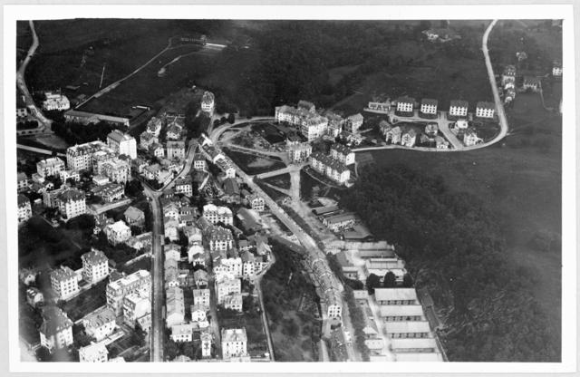
Vue aérienne du haut des quartiers de la Pontaise 1914

<h3>Une période de croissance et de tensions</h3>

Après les premiers changements visuels des quartiers, la population augmente (la Pontaise passe de 1500 à 2300 habitants entre 1886 et 1896) et fait face aux premières tensions.

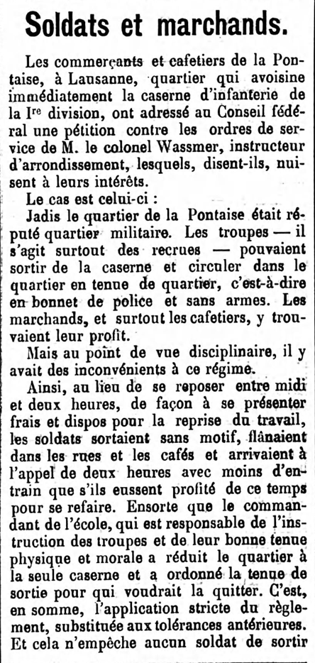
Extrait de la Gazette de Lausanne - L'affaire de la tenue de sortie

<h4>Tensions à la Pontaise :  Eau, commerce et sécurité</h4>

Plusieurs pénuries d’eau frappent le quartier de la Pontaise en 1887, notamment à cause de la présence simultanée des casernes et des abattoirs, particulièrement aquavores<a href="#fn4" id="ref4" class="footnote-link">[4]</a>. Une intense activité commerciale se développe dans le quartier autour de la Caserne, profitant notamment des sorties de recrues, qui remplissent les cafés attenants.

Cette dépendance commerciale est particulièrement palpable en 1901 lorsque le Colonel Wassmer refuse aux militaires de sortir à midi sans leur tenue de sortie, les incitant à rester en caserne. Le quartier s’insurge, faisant parvenir une pétition au Conseil Fédéral. Selon la <em>Gazette de Lausanne</em> du 29 mai 1901, les commerçants de la Pontaise dépendent de ces pauses de midi, avant l’appel de deux heures. Cette contrainte réglementaire incitait les militaires à délaisser les abords de la caserne, au déplaisir des commerçants du quartier<a href="#fn8" id="ref8" class="footnote-link">[8]</a>.

En 1898, le quartier voit ses rues nommées afin de mettre fin au “dédale” installé par l’aménagement chaotique progressif des rues<a href="#fn15" id="ref15" class="footnote-link">[15]</a>. En 1904, le café de la Violette, dit de tempérance, viendra s’installer non loin de la caserne pour combattre les dérives de l’alcool<a href="#fn16" id="ref16" class="footnote-link">[16]</a>.

Le stand de tir pose également problème : un grave accident survient en 1912 où une manipulation dangereuse fait perdre la vie à un père de famille<a href="#fn17" id="ref17" class="footnote-link">[17]</a>. Bien que le stand fût sécurisé en 1921 (murs en béton, cibles électriques)<a href="#fn6" id="ref6" class="footnote-link">[6]</a>, son emplacement continuera à faire débat jusqu'en 1934 au moins<a href="#fn7" id="ref7" class="footnote-link">[7]</a>.

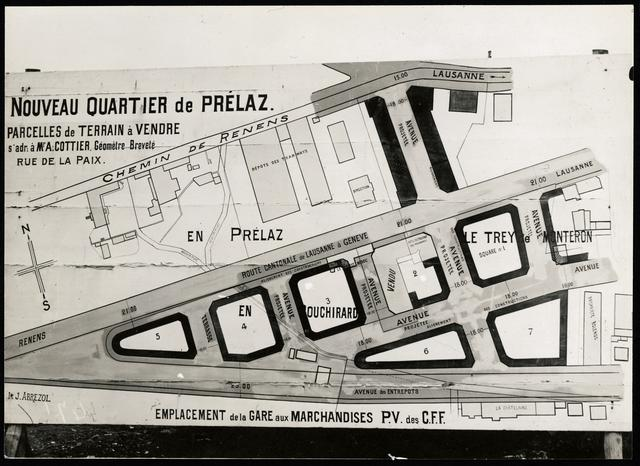
Plan du nouveau quartier de Prélaz, 1913

<h4>Tensions à Prélaz :  Inondations, transports et hygiénisme</h4>

A Prélaz, les inondations du Flon et de la Mèbre sont fréquentes et mettent en péril les cultures ouvrières (1910 et 1917)<a href="#fn18" id="ref18" class="footnote-link">[18]</a> et on y déplore plusieurs accidents de la route entre des piétons, vélos et les multiples tramways sortant du dépôt.

Le collège de Prélaz, fini en 1908, est une prouesse pour l’époque : avec ses baies vitrées et son linoléum, l’établissement scolaire est à la pointe de la technologie hygiéniste<a href="#fn19" id="ref19" class="footnote-link">[19]</a>. Malgré son coût (fr. 500’000), il a le rapport prix/classe le plus attractif de Lausanne.

Face à la population grandissante, la Société coopérative d’habitation fonde la cité ouvrière de <em>Prélaz-Cottages</em>, un sous-quartier qui se démarque par des maisons en terre cuite et ciment, dotées de jardins ouvriers. Standardisées, elles respectent des règles sanitaires afin d’assurer la salubrité des nouvelles habitations<a href="#fn20" id="ref20" class="footnote-link">[20]</a>. L’hygiénisme est une réponse à la crise du logement ouvrier engendrée par l’industrialisation du quartier.

<h3>Stabilisation, culture et religion</h3>

Enfin, les deux quartiers vivent une phase de stabilisation, qui se constate par l’implantation d’édifices religieux. À la Pontaise voit le jour le <strong>Temple Saint-Luc</strong>, dont la construction en avril 1940 est l’aboutissement de décennies de discussions et recherches de fonds<a href="#fn21" id="ref21" class="footnote-link">[21]</a>. À Prélaz, l'<strong>église Saint-Joseph</strong> est consacrée par l’évêque en juin 1936<a href="#fn22" id="ref22" class="footnote-link">[22]</a>, tandis qu’une chapelle protestante (transférée de Bellevaux) complète le chapelet d’églises en 1940<a href="#fn23" id="ref23" class="footnote-link">[23]</a>.

En parallèle, les activités sportives et culturelles se développent :

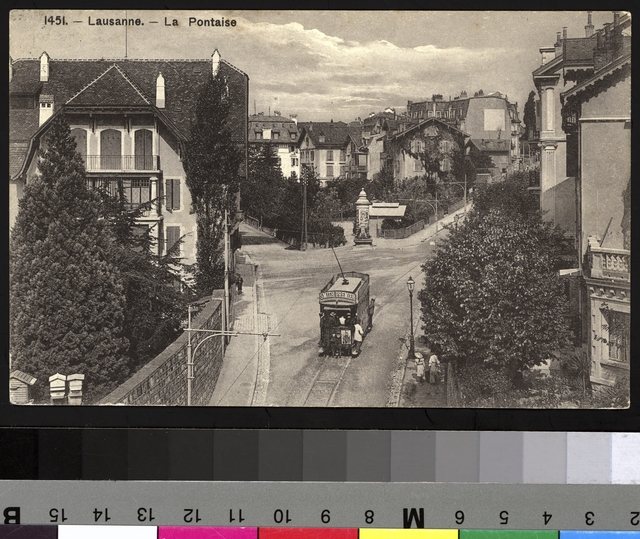
Tram sur la rue de la Pontaise et l'avenue Druey 1900–1911

<ul>
<li><strong>Chant et culture :</strong> La chorale de la Pontaise donne de nombreux concerts à travers la ville et participe aux défilés des 1er-août.</li>
<li><strong>Aviation :</strong> Profitant des étendues et esplanades autour du terrain militaire, la Pontaise devient le cadre de différents meetings d’aviation (1911, 1913 et 1924) sur les Plaines-du-Loup. Le quartier devient alors un “aérodrome” improvisé et l’on réorganise la circulation afin que les nombreux curieux puissent apercevoir les engins volants.</li>
<li><strong>Sport :</strong> Le développement des installations sportives de la Pontaise avec le stade de Montriond-Sports (futur Lausanne-Sport) dès 1912<a href="#fn24" id="ref24" class="footnote-link">[24]</a>, complété par le Vélodrome en 1921-22<a href="#fn25" id="ref25" class="footnote-link">[25]</a>, donne un dynamisme sportif au quartier. De nombreux événements déplacent la population dans les hauteurs de la cité, notamment le match Suisse-Tchécoslovaquie en mai 1929, qui attire 20’000 spectateurs<a href="#fn24" id="ref24" class="footnote-link">[24]</a>, ou le triomphe de la Suisse face à la France en avril 1945 (25’000 spectateurs).</li>
</ul>

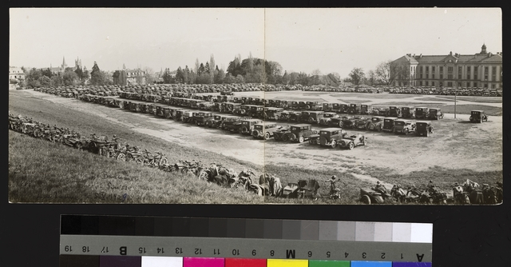
Match Tchéco-Slovaquie Suisse 1926

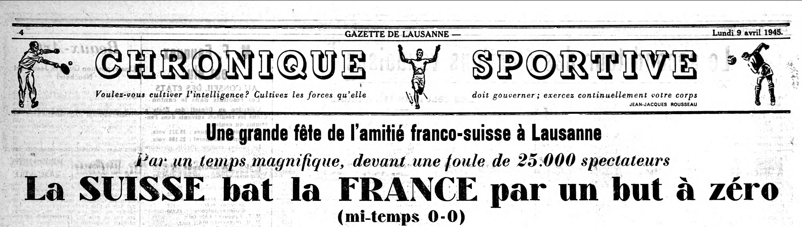
Extrait de la Gazette de Lausanne du 9 avril 1945

<h2>Être un quartier :  Quelques mots sur la vie à la Pontaise et Prélaz</h2>

La sociabilité à la Pontaise et Prélaz se matérialise par différents lieux et caractéristiques. Les cafés, les associations, les rassemblements populaires et les lieux communs font vivre les différents quartiers en lui apportant vie et dynamisme.

<!-- Section Cafés -->

<h3>Les cafés</h3>

<strong>À la Pontaise :</strong> La présence de la caserne (inaugurée en 1892) engendre une économie liée à la boisson florissante et lucrative (<em>Café du Stand, la Brasserie du Mont-Blanc, le Café des Casernes, le Café des Lauriers</em> ou encore le <em>Café Nicollier</em>). Ces lieux de consommation sont aussi des espaces d’échange où l’on dépose des formulaires de référendum (notamment à la fin du XIXe siècle), où l’on tient des assemblées générales (comme les Libéraux dans les années 1910 et 1930) et des bureaux de vote.

Derrière ces échanges se cache néanmoins un cadre de violence : la Brasserie du Mont-Blanc est marquée par des rixes entre Vaudois et ouvriers italiens (1895)<a href="#fn31" id="ref31" class="footnote-link">[31]</a>, tandis que des bagarres entre ivrognes y sont fréquentes. En réponse à ce climat conflictuel, le <em>Café de la Violette</em> est fondé en 1904 par une société philanthropique. Ce restaurant "de tempérance" est soutenu par les officiers pour offrir aux recrues "des locaux propres, des journaux et des jeux de quilles" sans alcool<a href="#fn16" id="ref16" class="footnote-link">[16]</a>.

<strong>À Prélaz :</strong> On retrouve également quelques cafés servant de lieux de rencontre pour des assemblées ou les travailleurs de ce quartier industriel et ouvrier (<em>Café de Sébeillon, Café de Prélaz-Nouveau</em> ou encore le <em>Café au Poirier</em>).

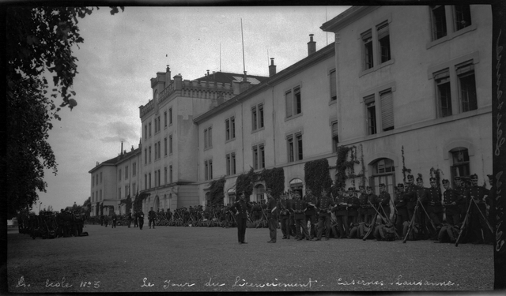
Le jour du licenciement (devant la caserne 1900-1915)

<!-- Section Associations -->

<h3>Les associations</h3>

Les associations sont un liant important dans la vie de quartier.

Le quartier de la Pontaise peut se targuer d’avoir une chorale dès 1906. Composée de 16 chanteurs (puis 90), la <strong>Chorale de la Pontaise</strong> se produit régulièrement à Lausanne, où elle anime les banquets, les fêtes patriotiques, donne des concerts annuels au Casino de Montbenon ou au Comptoir Suisse, souvent suivis de bals et de tombolas (avec opérettes ou ballets). Elle est liée autour de la devise "Par le chant à l'amitié"<a href="#fn26" id="ref26" class="footnote-link">[26]</a>.

La Pontaise possède aussi une association liée au quartier, fondée en 1881 : <strong>"Les Amis de la Pontaise"</strong>. Elle construit en 1892 une table d’orientation près de la caserne. Elle comptera en 1920, plus de 350 membres avant de devenir, en 1934, la <em>Société de développement du Nord</em><a href="#fn27" id="ref27" class="footnote-link">[27]</a>. Sa sociabilité est culturelle et éducative : elle gère une bibliothèque populaire de 2000 volumes, offre une horloge électrique au quartier en 1928 et organise des conférences publiques sur l’hygiène sociale (notamment sur les "maladies secrètes" en 1919).

A Prélaz, on trouve une société similaire, la <strong>Société de développement de l’Ouest</strong>, dont le travail vise à améliorer la vie de quartier. En 1941, elle a notamment organisé un concours de jardins familiaux au Parc de Valency, alors que le parc était utilisé pour des cultures de pommes de terre dans le cadre du plan Wahlen.

<!-- Section Rassemblements -->

<h3>Les rassemblements populaires</h3>

Plusieurs fêtes rassemblent la population : c’est le cas notamment de la fête nationale du 1er août, des différentes kermesses et des représentations culturelles (théâtre, musique).

Les kermesses paroissiales vont de pair avec la construction des églises Saint-Joseph à Prélaz et du temple de Saint-Luc à la Pontaise. En septembre 1936 par exemple, la paroisse catholique Saint-Joseph organise à Prélaz une grande vente-kermesse sous les ombrages de son parc, avec jeux pour enfants, cantines couvertes et soupers chauds<a href="#fn22" id="ref22" class="footnote-link">[22]</a>.

Du côté de la Pontaise, la fête nationale marque chaque année, le premier août, un événement majeur autour de la caserne. Sur l’esplanade attenante, la foule se réunit autour des fanfares militaires et de la Chorale de la Pontaise. Les conseillers d’État y font leurs discours, avant que la soirée ne s’achève par le traditionnel feu d’artifice, les retraites aux flambeaux et le cantique suisse.

Notons enfin la présence d’un théâtre en plein air à Prélaz en 1937, pour lequel une troupe de 200 comédiens et comédiennes montent la pièce <em>Jedermann</em> (Le Jeu de la mort de l’homme riche) dans le Parc de Prélaz. La troupe de Radio-théâtre diffuse la pièce de manière radiodiffusée.

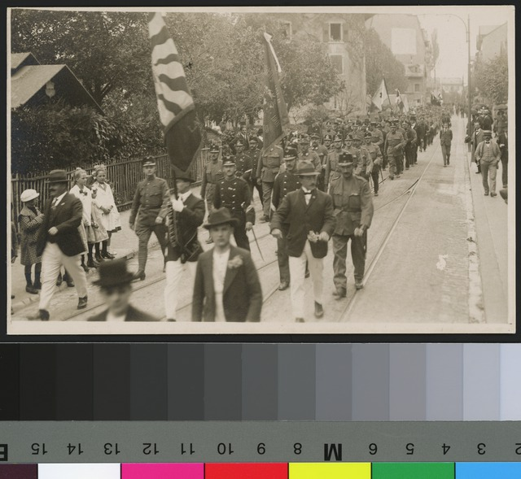
Défilé 1920-1926

<!-- Section Lieux Communs -->

<h3>Les lieux communs</h3>

Plusieurs espaces extérieurs servent de lieux de rencontre et participent à la sociabilité du quartier.

La presse ne parle pas spécifiquement de places qui agiraient comme lieux de rassemblements, mais d’autres espaces jouent ce rôle. Exception faite de la <strong>Place de la Liberté</strong>, qui remplace le carrefour du Verger en 1898, une fois qu’on y a planté un arbre, servant de repère au quartier<a href="#fn28" id="ref28" class="footnote-link">[28]</a>.

À la Pontaise, c’est l’esplanade militaire (<strong>Pré Noverraz</strong>), en face de la caserne qui sert de lieu de promenade pour les civils qui viennent écouter la fanfare. La proximité peut néanmoins créer des frictions entre la population civile et les militaires. En 1905, après des insultes proférées à l’égard de soldats, la garde est sommée de charger la foule à la baïonnette<a href="#fn29" id="ref29" class="footnote-link">[29]</a>.

Le voisinage est parfois source de tensions au sein des ménages. En 1933, une affaire judiciaire éclate autour du meurtre de M. Gaudard par V. Longchamp. Cet incident dramatique est l’aboutissement d’une dispute entre voisines au sujet d’un trou dans un mur mitoyen pour accrocher une bicyclette<a href="#fn30" id="ref30" class="footnote-link">[30]</a>.

À Prélaz, on pourra noter que les <strong>jardins ouvriers</strong> et les cours intérieures ont pu servir de lieux de sociabilisation. La cité coopérative de <em>Prélaz-Cottages</em>, créée en 1921 est l’occasion pour les locataires de se rencontrer car chacun a son jardin de 100 mètres carrés<a href="#fn20" id="ref20" class="footnote-link">[20]</a>. Ils peuvent aussi bricoler dans les ateliers partagés du sous-sol.

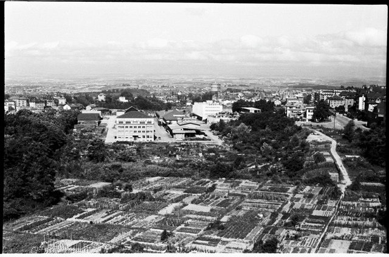
Jardins de Prélaz

← Glissez horizontalement pour faire défiler la ligne temporelle entre les deux quartiers (1870 - 1945) →

<!-- 1873-1875 -->

<h4>La Pontaise</h4>

<strong>1873-1875 :</strong> Construction de modestes maisons d'ouvriers unifamiliales et inauguration du nouvel Orphelinat cantonal.

1873-1875

<h4>Prélaz</h4>

<strong>1873-1875 :</strong> Zone agricole patricienne active (vente d'herbe et de bétail) et morcellement du domaine de Mme Muller.

<!-- 1878-1882 -->

<h4>La Pontaise</h4>

<strong>1878-1882 :</strong> Décision d'implanter la Caserne militaire (Plaines du Loup) et inauguration officielle en avril 1882.

1878-1882

<h4>Prélaz</h4>

<strong>1878 :</strong> Présentation du plan Laurent et Rossire visant le comblement de la vallée du Flon à des fins logistiques.

<!-- 1887-1892 -->

<h4>La Pontaise</h4>

<strong>1887-1892 :</strong> Conflits d'usage de l'eau (casernes vs nouveaux abattoirs) ; arrestation d'un faux-monnayeur derrière le stand de tir (1892).

1887-1892

<h4>Prélaz</h4>

<strong>1892 :</strong> La foudre frappe la propriété du député Fleury ; l'industrialisation démarre timidement dans le secteur.

<!-- 1898-1902 -->

<h4>La Pontaise</h4>

<strong>1898 :</strong> La municipalité s'organise et nomme officiellement les rues pour rationaliser le dédale du quartier.

1898-1902

<h4>Prélaz</h4>

<strong>1902 :</strong> Tournant majeur avec le transfert du dépôt principal et des ateliers de réparation des Tramways Lausannois (TL).

<!-- 1901-1904 -->

<h4>La Pontaise</h4>

<strong>1901 :</strong> Affaire Wassmer (interdiction des tenues de quartier) et décision de bâtir la prison du Bois-Mermet.

1901-1904

<h4>Prélaz</h4>

<strong>1904 :</strong> Implantation industrielle renforcée par l'arrivée de la Manufacture lausannoise de Biscuits.

<!-- 1905-1908 -->

<h4>La Pontaise</h4>

<strong>1905-1908 :</strong> Échauffourées militaires (1905); ouverture du café de tempérance sans alcool La Violette (1908).

1905-1908

<h4>Prélaz</h4>

<strong>1908 :</strong> Inauguration du Collège de Prélaz, modèle architectural hygiéniste (linoléum, vastes baies vitrées).

<!-- 1910-1912 -->

<h4>La Pontaise</h4>

<strong>1912 :</strong> Drame au stand de tir ; aménagement du terrain de Montriond-Sports (futur Lausanne-Sports) dans le quartier.

1910-1912

<h4>Prélaz</h4>

<strong>1910 :</strong> Crues violentes de la rivière du Flon et de la Mèbre, inondant et endommageant les cultures ouvrières.

<!-- 1921 -->

<h4>La Pontaise</h4>

<strong>1921 :</strong> Sécurisation physique du stand de tir à la suite des plaintes récurrentes de la population (murs de béton).

1921

<h4>Prélaz</h4>

<strong>1921 :</strong> Face à la crise du logement, création de la cité ouvrière coopérative standardisée de Prélaz-Cottages.

<!-- 1926-1927 -->

<h4>La Pontaise</h4>

<strong>1926 :</strong> Inauguration du Vélodrome de la Pontaise, renforçant l'influence et le pôle d'attraction sportive du quartier.

1926-1927

<h4>Prélaz</h4>

<strong>1927 :</strong> Fin du long chantier ferroviaire avec l'inauguration décisive de la Gare aux marchandises de Sébeillon/Prélaz.

<!-- 1929-1933 -->

<h4>La Pontaise</h4>

<strong>1929-1933 :</strong> Match international Suisse-Tchécoslovaquie (20'000 personnes) ; meurtre crapuleux à la suite d'une querelle de voisinage (1933).

1929-1933

<h4>Prélaz</h4>

<strong>1930-1932 :</strong> Expropriation de terrains pour construire une route. Construction de logements et nombreux chemins privés rendus publics.

<strong>1932 :</strong> Inauguration du bâtiment scolaire (primaire) de Prélaz.

<!-- 1936-1940 -->

<h4>La Pontaise</h4>

<strong>1940 :</strong> Point d'orgue de l'ancrage religieux avec l'inauguration du temple paroissial protestant de Saint-Luc.

1936-1940

<h4>Prélaz</h4>

<strong>1936-1940 :</strong> Consécration de l'église catholique Saint-Joseph (1936) ; transfert et réinstallation d'une chapelle en bois protestante (1940).

<!-- 1943-1945 -->

<h4>La Pontaise</h4>

<strong>1945 :</strong> Triomphe sportif du match Suisse-France devant plus de 25 000 spectateurs sur les hauts de la ville.

1943-1945

<h4>Prélaz</h4>

<strong>1939-1943 :</strong> Économie de guerre (rations) et hausse de la mortalité routière due à la cohabitation difficile tram/camion.

<!-- Zone d'affichage académique des sources et notes bibliographiques -->

<h3>Sources</h3>
<ol>
<li id="fn1"><em>Gazette de Lausanne (GDL)</em>, 30 novembre 1878 : Débats du Conseil communal concernant l'implantation et le financement de la caserne fédérale. <a href="#ref1" class="backlink">↩</a></li>
<li id="fn2"><em>Gazette de Lausanne (GDL)</em>, 8 octobre 1873 : Cérémonie d'inauguration officielle du nouvel Orphelinat cantonal sur les hauts de la Pontaise. <a href="#ref2" class="backlink">↩</a></li>
<li id="fn3"><em>Gazette de Lausanne (GDL)</em>, 5 février 1881 : Agrandissement des stands et des infrastructures de tir militaires de la Pontaise. <a href="#ref3" class="backlink">↩</a></li>
<li id="fn4"><em>Gazette de Lausanne (GDL)</em>, 16 mai 1887 : Rapport de la commission technique sur l'approvisionnement en eau des abattoirs et de la caserne. <a href="#ref4" class="backlink">↩</a></li>
<li id="fn5"><em>Gazette de Lausanne (GDL)</em>, 27 novembre 1901 : Vote cantonal sur le projet d'implantation de la prison de district au Bois-Mermet. <a href="#ref5" class="backlink">↩</a></li>
<li id="fn6"><em>Gazette de Lausanne (GDL)</em>, 28 juillet 1921 : Sécurisation et modernisation technique des installations de tir. <a href="#ref6" class="backlink">↩</a></li>
<li id="fn7"><em>Gazette de Lausanne (GDL)</em>, 11 juin 1934 : Pétition des habitants du Nord pour réclamer le déplacement définitif du stand de tir. <a href="#ref7" class="backlink">↩</a></li>
<li id="fn8"><em>Gazette de Lausanne (GDL)</em>, 29 mai 1901 : Détails sur la pétition envoyée au Conseil fédéral contre les ordres du Colonel Wassmer. <a href="#ref8" class="backlink">↩</a></li>
<li id="fn9"><em>Gazette de Lausanne (GDL)</em>, 20 juillet 1878 : Présentation publique du plan Laurent-Rossire de comblement de la vallée du Flon. <a href="#ref9" class="backlink">↩</a></li>
<li id="fn10"><em>Gazette de Lausanne (GDL)</em>, 29 mai 1927 : Reportage sur l'ouverture de la nouvelle gare aux marchandises de Sébeillon/Prélaz. <a href="#ref10" class="backlink">↩</a></li>
<li id="fn11"><em>Gazette de Lausanne (GDL)</em>, 26 février 1902 : Devis de construction et plans des futurs ateliers de réparation des tramways. <a href="#ref11" class="backlink">↩</a></li>
<li id="fn12"><em>Gazette de Lausanne (GDL)</em>, 29 juin 1904 : Annonce légale de la constitution de la Manufacture lausannoise de Biscuits à Prélaz. <a href="#ref12" class="backlink">↩</a></li>
<li id="fn13"><em>L'Estafette</em>, 26 juillet 1873 : Annonces foncières et commerciales relatives aux ventes agricoles dans la plaine de Prélaz. <a href="#ref13" class="backlink">↩</a></li>
<li id="fn14"><em>Gazette de Lausanne (GDL)</em>, 3 avril 1882 : Compte-rendu de la cérémonie d'inauguration de la Caserne militaire de la Pontaise. <a href="#ref14" class="backlink">↩</a></li>
<li id="fn15"><em>Gazette de Lausanne (GDL)</em>, 20 avril 1898 : Décision administrative de la municipalité concernant le tracé et la dénomination des nouvelles rues. <a href="#ref15" class="backlink">↩</a></li>
<li id="fn16"><em>Gazette de Lausanne (GDL)</em>, 4 novembre 1908 : Inauguration de la taverne de tempérance La Violette par l'association philanthropique locale. <a href="#ref16" class="backlink">↩</a></li>
<li id="fn17"><em>Gazette de Lausanne (GDL)</em>, 10 juin 1912 : Enquête de police sur l'accident mortel survenu sur le champ de tir. <a href="#ref17" class="backlink">↩</a></li>
<li id="fn18"><em>Gazette de Lausanne (GDL)</em>, 18 décembre 1910 : Rapport sur la crue catastrophique du Flon et les dégâts aux infrastructures industrielles de Prélaz. <a href="#ref18" class="backlink">↩</a></li>
<li id="fn19"><em>Gazette de Lausanne (GDL)</em>, 28 avril 1908 : Présentation technique du nouveau Collège de Prélaz. <a href="#ref19" class="backlink">↩</a></li>
<li id="fn20"><em>Gazette de Lausanne (GDL)</em>, 19 décembre 1921 : Plan et statuts financiers de la future cité ouvrière Prélaz-Cottages. <a href="#ref20" class="backlink">↩</a></li>
<li id="fn21"><em>Gazette de Lausanne (GDL)</em>, 9 avril 1940 : Chronique paroissiale sur la dédicace solennelle du nouveau Temple Saint-Luc. <a href="#ref21" class="backlink">↩</a></li>
<li id="fn22"><em>Gazette de Lausanne (GDL)</em>, 7 juin 1936 : Consécration de l'église Saint-Joseph par Mgr Besson devant la communauté catholique de l'Ouest. <a href="#ref22" class="backlink">↩</a></li>
<li id="fn23"><em>Gazette de Lausanne (GDL)</em>, 1 octobre 1940 : Cérémonie d'installation de la chapelle protestante transférée. <a href="#ref23" class="backlink">↩</a></li>
<li id="fn24"><em>Gazette de Lausanne (GDL)</em>, 19 octobre 1912 : Inauguration des nouvelles installations du terrain de football de la Pontaise. <a href="#ref24" class="backlink">↩</a></li>
<li id="fn25"><em>Gazette de Lausanne (GDL)</em>, 6 avril 1926 : Compte-rendu du meeting de réouverture du vélodrome de Lausanne. <a href="#ref25" class="backlink">↩</a></li>
<li id="fn26"><em>Gazette de Lausanne (GDL)</em>, 17 juin 1931 : Chronique du concert de gala annuel de la Chorale de la Pontaise au Casino de Montbenon. <a href="#ref26" class="backlink">↩</a></li>
<li id="fn27"><em>Gazette de Lausanne (GDL)</em>, 19 mai 1892 : Publication du panorama et de la table d'orientation par la Société des Amis de la Pontaise. <a href="#ref27" class="backlink">↩</a></li>
<li id="fn28"><em>Gazette de Lausanne (GDL)</em>, 1 mars 1875 : Aménagement urbain de la Place de la Liberté. <a href="#ref28" class="backlink">↩</a></li>
<li id="fn29"><em>Gazette de Lausanne (GDL)</em>, 5 mai 1905 : Rapport de police sur les échauffourées militaires à la suite des tensions du Pré Noverraz. <a href="#ref29" class="backlink">↩</a></li>
<li id="fn30"><em>Gazette de Lausanne (GDL)</em>, 5 juillet 1933 : Compte-rendu judiciaire du procès criminel de l'affaire de meurtre commis à la Pontaise. <a href="#ref30" class="backlink">↩</a></li>
<li id="fn31"><em>Gazette de Lausanne (GDL)</em>, 21 octobre 1895 : Fait divers à la Brasserie du Mont-Blanc : querelle au couteaux entre danseurs italiens et vaudois. <a href="#ref31" class="backlink">↩</a></li>
</ol>

