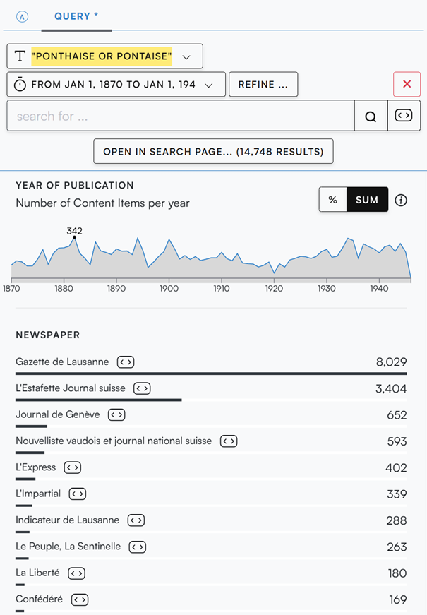
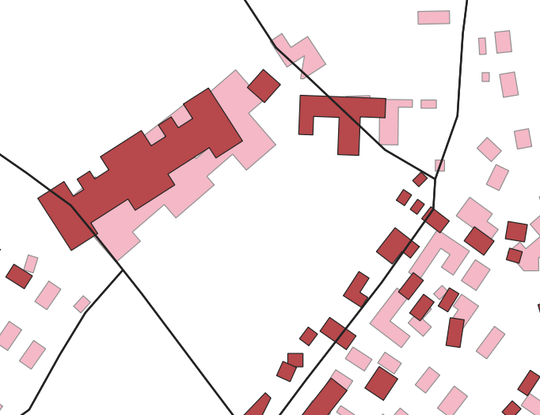

<style>
    /* Justification et élargissement global des textes pour occuper toute la largeur */
    h1, h2, h3, h4, p, li, ul, ol {
    max-width: none !important;
    text-align: justify;
    text-justify: inter-word;
    -webkit-hyphens: auto;
    -ms-hyphens: auto;
    hyphens: auto;
    }


    .obs-container h1, 
    .obs-container h2, 
    .obs-container h3, 
    .obs-container h4,
    .timeline-card h4 {
    font-family: Georgia, Cambria, "Times New Roman", Times, serif !important;
    color: #1a1a1a !important;
    letter-spacing: -0.01em;
    }

    /* Style global du conteneur */
    .obs-container {
    font-family: system-ui, -apple-system, BlinkMacSystemFont, "Segoe UI", Roboto, Helvetica, Arial, sans-serif;
    color: #24292e;
    line-height: 1.6;
    max-width: 1012px;
    margin: 0 auto;
    padding: 10px;
    }
    .obs-container h1 {
    font-size: 2em;
    border-bottom: 1px solid #eaecef;
    padding-bottom: 0.3em;
    margin-top: 24px;
    margin-bottom: 16px;
    font-weight: 600;
    }
    .obs-container h2 {
    font-size: 1.5em;
    border-bottom: 1px solid #eaecef;
    padding-bottom: 0.3em;
    margin-top: 32px;
    margin-bottom: 16px;
    font-weight: 600;
    }
    .obs-container h3 {
    font-size: 1.25em;
    margin-top: 24px;
    margin-bottom: 12px;
    font-weight: 600;
    }
    .obs-container h4 {
    font-size: 1.1em;
    margin-top: 20px;
    margin-bottom: 8px;
    font-weight: 600;
    }

</style>

<div class="obs-container" lang="fr">

<h1>Méthodes</h1>

<h2 id="Presse" tabindex="-1">Presse</h2>

Le site [Impresso Project](https://impresso-project.ch/) a été utilisé pour étudier la presse lausannoise entre 1870 et 1945. L'étude s'est attardée sur le <em>La Gazette de Lausanne</em> ainsi que <em>L'Estafette</em>. La recherche s'est faite par mots-clefs "Ponthaise" ou "Pontaise" et "Prélaz" ou "Prelaz". Plus de 10'000 différentes coupures de presse ont été passées en revue et sélectionnées selon leur pertinence quant à la vie des quartiers. Les événements saillant ont permis de reconstruire une chronologie et de déduire des schémas similaires entre les deux quartiers.

Cette approche est sensible à la qualité de l'OCR présent sur le site Impresso Project, ainsi que biaisée car la presse ne relaie pas tous les événements historiques et que le rapport sur certains événements peuvent être influencés par l'avis de leur auteurs.

<div style="display: flex; gap: 20px; width: 100%; margin: 20px 0;">
  
  <div style="flex: 1; text-align: center;">
    
    <p style="margin-top: 8px; font-style: italic; text-align: center !important;">Coupures de presse "Pontaise" (1870-1945)</p>
  </div>

  <div style="flex: 1; text-align: center;">
    
    <p style="margin-top: 8px; font-style: italic; text-align: center !important;">Coupures de presse "Prélaz" (1870-1945)</p>
  </div>

</div>


<h2 id="Toponymie" tabindex="-1">Toponymie</h2>

Notre procédure générale pour analyser la toponymie des quartiers a été la suivante:

<ol>
  <li>Définir le périmètre que nous utiliserions comme définition géographique des quartiers de la Pontaise et Prélaz.</li>
  <li>Examiner plusieurs cartes historiques de Lausanne pour voir quels lieux-dits sont indiqués dans les périmètre que nous avons choisis.</li>
  <li>Nous avons considéré qu'un lieu-dit qui apparaît dans le périmètre d'un quartier sur une carte donnée fait partie de la toponymie de ce quartier à ce moment-là.
</ol>

La définition géographique des quartiers constitue un point sensible de notre recherche. Nous avons fait les choix de périmètres suivants, basés sur les [secteurs statistiques officiels de la ville de Lausanne](https://www.lausanne.ch/.binaryData/website/path/lausanne/officiel/statistique/quartiers/cartes-thematiques/contentAutogenerated/autogeneratedContainer/col1/01/linkList/0/websitedownload/Quartiers%20et%20secteurs%20statistiques%20v2%20WEB.2025-05-21-15-42-27.pdf):

<ul>
  <li>La Pontaise correspond au secteur 1503 (Pontaise), pour utiliser la définition en vigueur de la ville de Lausanne, sans raison d'en choisir une autre.</li>
  <li>Prélaz correspond aux secteurs 304 (Prélaz) et 301 (Avenue de Morges). Le premier peut être vu comme la définition "officielle" statistique du quartier par la ville de Lausanne, et le second contient un certain nombre d'établissements comportant "Prélaz" dans leur nom, tel que le Collège de Prélaz, ce qui laisse à penser qu'une définition culturelle raisonnable du quartier l'inclut également.</li>
</ul>

<h2 id="Bâti" tabindex="-1">Bâti</h2>

Les cartes Siegfried donnent la base de l'analyse du bâti. Cette série de cartes couvre précisément la période concernée, de 1873 à 1945. Vu que les quartiers de la Pontaise et Prélaz ont très peu de développement avant 1880, il n'y a pas trop d'intérêt à analyser des cartes plus anciennes. Les cartes siegfried ont été géoréférencées et vectorisées par le département de digital humanities. 


Le but est de montrer l'évolution du bâti d’une manière spatio-temporelle. Nous avons tenté d'utiliser 1945 comme référence et noter les polygones présents avec une forme similaire au même endroit selon l' indice et distance de Jaccard (IoU). Cela veut dire le rapport entre l'intersection et l’union des polygons. Malheureusement, le géoréférencement n’est pas statique. Entre les cartes de 1926 et 1928, il y a une discontinuité sévère. Le même immeuble peut se déplacer à des dizaines de mètres comme vous le voyez en dessous. Alors, nous avons pris une approche manuelle en évaluant si chaque immeuble présent en 1945 était aussi présent dans les autres cartes.



Ce n’est pas une méthode exacte pour déterminer l'évolution du bâti car l'évaluation a été faite d’une manière subjective. Cependant, ça donne une idée d'évolution.


<h2 id="Métiers" tabindex="-1">Métiers</h2>

Les Annuaires commerciaux, qui ont déjà été passés par OCR, offrent une vue globale sur Lausanne. Pour restreindre notre vue aux quartiers choisis, la toponymie est utilisée pour rassembler des uniquement les entrées avec des addresses similaires aux lieux relevés. Malheureusement, cela implique la perte d'une fraction des données totales. Une autre methodologie imaginée était de geolocaliser toutes les entrées et prendre seulement celles a l'intérieur de nos quartiers; or tous les problèmes liées à la géolocalisation seraient exacerbés par des ordres de magnitudes.

Comme les erreurs d'OCR sont très communes, un calcul de similarité doit être fait. La distance de Levenshtein a été utilisée. Une fois les entrées réduites, l'addresse sansitisée est extraite en prennant le toponyme matché et le combine avec un numéro de la ligne d'addresse. De là, Nominatim peut prendre ces addresses et donner des coordonnées afin de géolocaliser l'entrée de l'Annuaire. 

Pour la classification, la liste de tous les métiers des personnes contenus dans les quartiers était longue de plus 1000 valeurs et la première idée était de faire quelques exemples manuellement et expliciter la logique afin de la passer à une IA de prediction de texte. Malheurseuement, les résultats avaient trop d'erreurs, alors la classification a été faite manuellement. 

Les catégories de classification des métiers étaient les suivantes :

* **Rien** : Entrées sans profession identifiée.
* **Inactif** : Personnes sans activité professionnelle déclarée (retraités, rentiers, etc.).
* **Prolétaire** : Travailleurs manuels, ouvriers, artisans et journaliers.
* **Intermédiaire** : Employés de bureau, commis, petits fonctionnaires et professions semi-qualifiées.
* **Élevé** : Professionnels libéraux, ingénieurs, cadres et haute fonction publique.
* **Commerce** : Les commerces (Fabric de biscuits, Carosserie, etc.).
* **???** : Entrées dont la classification restait ambiguë ou non déterminée.

```js
const classificationsCsv = await FileAttachment("../data/classifications-metiers.csv").text()
const classificationsBlob = new Blob([classificationsCsv], {type: "text/csv;charset=utf-8"})
const classificationsUrl = URL.createObjectURL(classificationsBlob)
const downloadLink = html`<a href=${classificationsUrl} download="classifications-metiers.csv" style="padding: 0.5rem 0.75rem; display: inline-block; background: #0366d6; color: white; border-radius: 4px; text-decoration: none;">Télécharger le CSV de classification</a>`

display(downloadLink)
```

<h2 id="Iconographie" tabindex="-1">Iconographie</h2>

La source de l'iconographie de Lausanne est le Musée historique de Lausanne. Les images sont géolocalisées. Cela permet de filtrer les images dans les secteurs administratifs de la Pontaise et de Prélaz entre 1845 et 1951. Nous avons ajouté un buffer de 100 mètres pour inclure des endroits importants comme la caserne qui se situent juste en dehors du secteur. L’iconographie de tout Lausane peut se voir sur le site [icon-lausanne](https://icono-lausanne.github.io/). Ces images sont aussi intégrées à la [Time Atlas](https://timeatlas.eu/), qui contient une iconographie plus globale.  

## Bibliographie

### Sources

#### Sources cartographiques

* **EPFL Cours HUM-450 & HUM-454**, “Diverses cartes de Lausanne”, Lausanne, 1870-1951.

#### Sources statistiques et administratives

* Annuaires Commerciaux officiels de la Ville de Lausanne,  éditions 1885,  1901,  1923,  1951.
* **Schnetzler, André**, *Enquête sur les conditions du logement : Année 1894*, Lausanne, Charles Viret-Genton, 1896. 
[+ Supplément, 1899].

#### Presse et chroniques locales

* *La Gazette de Lausanne*, quotidien lausannois, 1870-1945.
* *L’Estafette*, quotidien lausannois, 1870-1895.

#### Sources iconographiques

* Dépôt iconographique du Musée historique de Lausanne.


### Littérature secondaire

#### Le quartier comme objet historique

* **Authier, Jean-Yves.** « Les citadins et leur quartier », *L’Année sociologique*, vol. 58, n° 1, 2008, p. 21-46.
* **Authier, Jean-Yves.** *La Vie des lieux*, Presses universitaires de Lyon, 1993. DOI : [10.4000/books.pul.9065](https://doi.org/10.4000/books.pul.9065).
* **Authier, Jean-Yves, Marie-Hélène Bacqué et France Guérin-Pace (dir.).** *Le quartier : Enjeux scientifiques, actions pratiques et pratiques sociales*, Paris, La Découverte, 2006.
* **Bertoni, Angelo.** *À l’échelle du quartier : histoire d’une notion d’urbanisme (1890-1960)*, Genève, MētisPresses, 2024.
* **Bonneval, Loïc, et al.** « Étude des quartiers : défis et pistes de recherche », *Conférence Extraction et Gestion de Connaissances 2019 (EGC2019)*, Metz, 2019. HAL : [hal-02005923](https://hal.science/hal-02005923/document).
* **Cabantous, Alain.** « Le quartier, espace vécu à l'époque moderne », *Histoire, économie & société*, 13ᵉ année, n° 3, 1994 (*Lectures de la ville (XVe-XXe siècle)*), p. 427-439. DOI : [10.3406/hes.1994.1704](https://doi.org/10.3406/hes.1994.1704).
* **Saunier, Pierre-Yves.** « La ville en quartiers : découpages de la ville en histoire urbaine », *Genèses*, n° 15, 1994, p. 103-114.
* **Topalov, Christian.** « Les divisions de la ville : une approche par les mots », dans Christian Topalov (dir.), *Les divisions de la ville*, Éditions UNESCO, 2002, p. 1-5.

#### Études de cas

* **Bourillon, Florence, et al. (éd.).** *Du clos Saint-Lazare à la gare du Nord*, Presses universitaires de Rennes, Comité d’histoire de la ville de Paris, 2018. DOI : [10.4000/books.pur.174021](https://doi.org/10.4000/books.pur.174021).
* **Cantrelle, Sylvie, Corinne Goy et Claudine Munier.** *Histoire d’un quartier de Montbéliard (Doubs) : Le bourg Saint-Martin (XIIIe-XXe s.)*, Paris, Éditions de la Maison des sciences de l’homme, vol. 83, 2000. OpenEdition : [editionsmsh/46748](https://books.openedition.org/editionsmsh/46748).
* **Joffre, Pierre.** « Un autre XVIIIe. Socio-histoire d’un micro-quartier parisien, de 1880 à nos jours », *L’atelier du Centre de recherches historiques*, 2024. DOI : [10.4000/130f0](https://doi.org/10.4000/130f0).
* **Jacquot, Olivier.** [Cycle de séminaires] projet Richelieu. Histoire du quartier : « Documenter l’histoire urbaine, architecturale, sociale et culturelle du quartier Richelieu (1750-1950) », *Carnet de recherche*. DOI : [10.58079/m3o2](https://doi.org/10.58079/m3o2).
* **Vidal, Frédéric.** *Les habitants d’Alcântara : Histoire sociale d’un quartier de Lisbonne au début du 20e*, Presses universitaires du Septentrion, 2006. OpenEdition : [septentrion/56412](https://books.openedition.org/septentrion/56412).

</div>